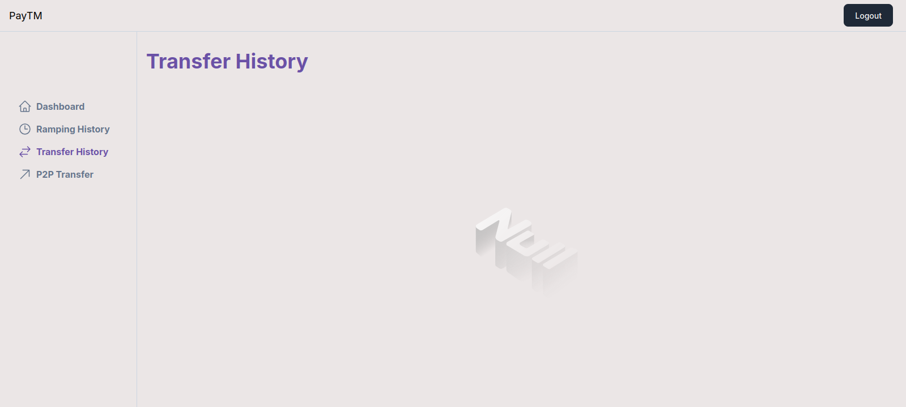

# Digital Wallet

This is a digital wallet application, like PayTM. It has two different applications, one for Regular Users and another for Merchants.

## User App Demo

## Features of the User App
- On-ramping money from banks
- Off-ramping money to banks
- Sending money to other users via phone number

## Bank Webhook Services
These were created for processing the legitimacy of the onramping and offramping of money from and to the banks.
Banks Supported:
- Axis Bank
- HDFC Bank

## Tech Stack Used
- Turborepo Code Structure (for maintaining different applications, user and merchant)
- Next.js for User App
- Express.js for Bank Webhook Services
- PostGreSQL Database
- Prisma ORM

## Future Improvements
The merchant app can be developed which will have the following features:
- Generate a QR code, by scanning which we can make payments
- Offramp money of the merchant to his/her bank account every 2 days
